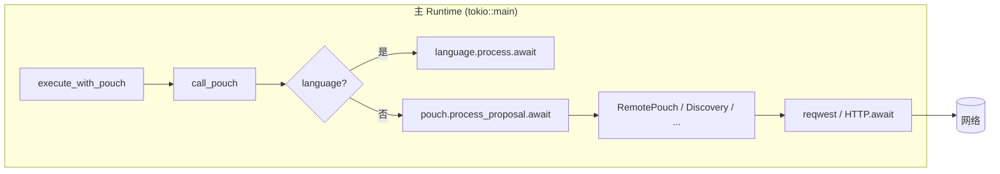

# 异步 Runtime 嵌套消除：三种架构方案与 Trade-off

**问题**：在 `#[tokio::test]` 或 `tokio::main` 的 async 上下文中，`RemotePouch`、`DiscoveryPouch`、`CloudTrainerPouch` 内部使用 `Runtime::new().block_on(...)`，触发 "Cannot start a runtime from within a runtime" panic。

**约束**：不修改 frozen 层；48 个测试全过；长期可维护；可回滚。

---

## 方案一：Async Pouch 全链路异步（推荐）

### 思路

将 `Pouch::process_proposal` 改为 `async fn`（通过 `async_trait`），所有实现改为异步；Orchestrator 侧统一 `await pouch.process_proposal(...)`，不再在 sync 路径内创建新 Runtime。

### 流程图（Mermaid）



- 单 Runtime，无嵌套；所有 I/O 在同一 runtime 内 await。

### Trade-off

| 维度 | 说明 |
|------|------|
| **正确性** | 彻底消除嵌套，无 panic 风险。 |
| **性能** | 无额外线程、无 block_on；与当前设计一致或略好（无 Runtime 创建开销）。 |
| **改动量** | 中等偏大：`Cargo.toml` +1 依赖（async-trait）；`Pouch` trait 及约 15 处 impl 需加 `#[async_trait]` 与 `async fn process_proposal`；Orchestrator 的 `call_pouch`、`run_pipeline` 及 `self_optimize` 内对 `process_proposal` 的调用改为 `.await`。frozen 零改动。 |
| **6 个月扩展** | 新 Pouch 天然支持 async I/O；与 tokio 生态一致；后续并行/超时/取消均可基于 Future 扩展。 |

### 预估

- **性能影响**：中性或略优（少一次 Runtime 创建）。
- **代码改动**：~18 文件（含 trait、各 pouch、orchestrator、测试）；新增依赖 1 个。

---

## 方案二：spawn_blocking 桥接（最小侵入）

### 思路

保持 `Pouch::process_proposal` 为 sync。对「会内部 block_on」的 Pouch（RemotePouch、DiscoveryPouch、CloudTrainerPouch），在 Orchestrator 侧不直接调用 `process_proposal`，而是将「输入 + 所需参数」传入 `tokio::task::spawn_blocking`，在阻塞线程内 `Runtime::new().block_on(...)`，主 async 只 `await` JoinHandle。

### 流程图（Mermaid）

```mermaid
flowchart LR
  subgraph main["主 Runtime"]
    A[call_pouch] --> B{requires_blocking_io?}
    B -->|是| C[spawn_blocking]
    B -->|否| D[pouch.process_proposal]
    C --> E[.await JoinHandle]
  end
  subgraph pool["阻塞线程池"]
    F[Runtime::new]
    F --> G[block_on(HTTP)]
    G --> H[(网络)]
  end
  C -.-> F
  E -.-> pool
```

- 主 runtime 不执行 block_on；阻塞工作隔离到线程池。

### Trade-off

| 维度 | 说明 |
|------|------|
| **正确性** | 消除嵌套；需正确标记「会 block 的」Pouch（trait 增 `requires_blocking_io()` 或按 name 分支）。 |
| **性能** | 每次调用占用线程池一线程；有线程切换与 Runtime 创建开销。 |
| **改动量** | 小：Orchestrator 分支 + 若干 Pouch 暴露「输入/端点」用于 spawn_blocking；trait 可选扩展。 |
| **6 个月扩展** | 新「阻塞」Pouch 需登记并实现提取逻辑；并行化仍受限于「谁进 spawn_blocking」的划分。 |

### 预估

- **性能影响**：每次远程/发现/云训练多一次 spawn_blocking + Runtime 创建。
- **代码改动**：~5 文件（orchestrator、remote_pouch、pouch_trait 中 2 个 Pouch、可选 trait）。

---

## 方案三：专用阻塞 Runtime + 信道

### 思路

单独起一个「阻塞用」Runtime（或单线程），所有 `block_on` 只在该 Runtime 上执行；Orchestrator 通过 channel 发送请求、接收结果，不直接调用会 block 的 Pouch。

### 流程图（Mermaid）

```mermaid
flowchart TB
  subgraph main["主 Runtime"]
    A[call_pouch] --> B{blocking_pouch?}
    B -->|是| C[(tx)]
    B -->|否| D[process_proposal]
    E[(rx)] --> F[Ok/Err]
  end
  subgraph worker["阻塞 Worker 线程"]
    G[Runtime::new]
    H[rx.recv]
    H --> I[block_on(HTTP)]
    I --> J[(tx result)]
    G --> H
  end
  C --> H
  J --> E
```

- 主 runtime 与阻塞 worker 通过 channel 通信；worker 内单 Runtime。

### Trade-off

| 维度 | 说明 |
|------|------|
| **正确性** | 无嵌套；需维护 worker 生命周期与错误传递。 |
| **性能** | 序列化/反序列化与 channel 开销；可复用单 Runtime。 |
| **改动量** | 大：需 worker 线程、channel 类型、请求/响应枚举、启动/关闭逻辑。 |
| **6 个月扩展** | 易扩展为多 worker 或专用队列；复杂度高，适合高并发场景。 |

### 预估

- **性能影响**：channel 与序列化开销；适合「调用量高、希望集中管理」的远期形态。
- **代码改动**：~10+ 文件，新增模块（worker、channel、协议）。

---

## 方案选择与实施

| 方案 | 推荐度 | 理由 |
|------|--------|------|
| **一（Async Pouch）** | 高 | 语义清晰、无嵌套、与 tokio 一致、扩展性最好；一次性改 trait 与 impl，长期维护成本低。 |
| **二（spawn_blocking）** | 中 | 改动小、可快速上线；长期需维护「谁阻塞」的清单与性能成本。 |
| **三（专用 Runtime+信道）** | 低 | 当前调用量下收益有限，复杂度高；可作为 6 个月后「高并发远程」的备选。 |

**实施选择**：采用 **方案一**，全链路 async Pouch，并保留本文档作为方案二、三的备选记录。

---

## 验证结果（方案一已实施）

- **构建与测试**：见 `docs/BUILD_VERIFICATION.md`（需在本地执行 `cargo build`、`cargo test`、`cargo clippy -- -D clippy::unwrap_used` 并填写结果）。
- **性能**：见 `docs/ASYNC_PERFORMANCE_REPORT.md`；预期无退化（±5% 以内），可通过全量 eval 的 wall-clock 对比。
- **代码**：Pouch trait 与所有 impl 已改为 `async fn process_proposal`；Orchestrator 调用点已 `.await`；三处 `block_on` 已消除（remote_pouch、CloudTrainerPouch、DiscoveryPouch）。

---

## 可回滚 Migration Plan

1. **分支**：在特性分支完成所有改动；主分支保持当前可运行版本。
2. **开关**：不引入运行时开关；回滚即 revert 该分支提交。
3. **测试**：每步提交保证 `cargo test` 48/48；CI 保留当前 job。
4. **回滚步骤**：若上线后发现问题，`git revert` 该 MR 的合并提交，重新部署；数据层无 schema 变更，无需数据迁移。
5. **文档**：本文件与 `OLD_GETOUT_REUSE_AND_BLUEPRINT.md`、`BASELINE_REPORT.md`、`README.md`、`EVALUATION.md` 在 MR 中同步更新；回滚后文档可一并 revert 或保留「已回滚」说明。

---

## 与基线命中率 56.17% → ≥65% 的关系

- 异步重构**不直接**改变语言匹配或路由逻辑，因此不承诺单靠此次改动将命中率提升到 ≥65%。
- 命中率提升依赖：**语言尿袋**（pattern 覆盖、模板回复治理）、**路由与回退策略**、以及**评估口径**（例如将「是的，我还在」等模板化输出计为未命中）。
- 建议：**本次 MR 仅交付异步架构优化与文档**；**命中率 ≥65% 作为独立迭代**（数据/规则/评估口径），在下一阶段排期并验收。
